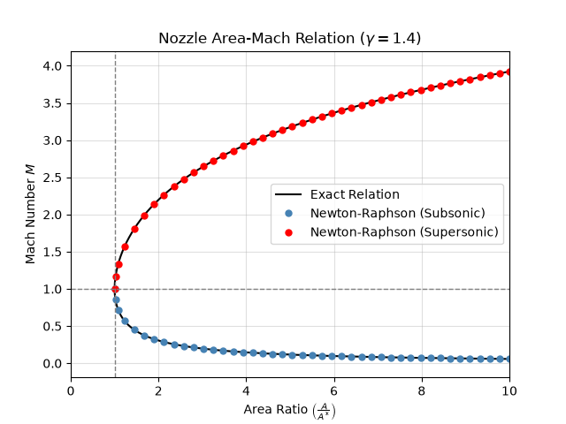

# Isentropic Nozzle Area–Mach Solver

Python tool that solves the quasi-1D isentropic area–Mach relation for both subsonic and supersonic Mach numbers using Newton–Raphson, and reports stagnation-to-static temperature, pressure, density, and acoustic speed ratios at each solution.



*Newton–Raphson solutions (markers) on the exact area–Mach relation (line) for specific heat ratio = 1.4. Every area ratio above 1 has a subsonic and a supersonic solution.*

---

## Overview

The area–Mach relation gives the area ratio $A/A^*$ directly from a Mach number, but nozzle design usually needs the reverse: given the geometry, what is the Mach number? The relation can't be inverted in closed form, and every area ratio above 1 corresponds to two Mach numbers, one subsonic and one supersonic, so this tool solves it numerically.

I built this as a weekend project to combine two things I'd learned separately: the area–Mach relation from my compressible flow coursework, and the Newton–Raphson method. The most interesting part turned out to be where they interact, since the method's weak point, a zero derivative, falls exactly at the nozzle throat.

Full derivation, method, and verification: [Technical report (PDF)](docs/1D_Isentropic_Nozzle_Solver_Technical_Report.pdf)

---

## Features

- Solves for both Mach numbers (subsonic and supersonic) from an area ratio
- Computes stagnation-to-static ratios $\frac{T_0}{T}$ (temperature), $\frac{p_0}{p}$ (pressure), $\frac{\rho_0}{\rho}$ (density), and $\frac{a_0}{a}$ (acoustic speed) at each solution
- Physically derived initial guesses, guaranteed to start on the correct branch
- Supports general specific heat ratio $\gamma > 1$
- Verification script comparing against published isentropic tables from Table B.1 of John and Keith, *Gas Dynamics*

---

## Model and Assumptions

- Quasi-one-dimensional, steady, adiabatic, isentropic flow
- Calorically perfect gas; γ = 1.4 by default
- A* is the sonic (M = 1) area, equal to the throat area when choked
- Not modeled: viscous effects, multidimensional flow, shocks

---

## Method

**Area–Mach relation** (squared form used in the solver):

$$\left(\frac{A}{A^*}\right)^2 = \frac{1}{M^2}\left[\frac{2}{\gamma+1}\left(1 + \frac{\gamma-1}{2}M^2\right)\right]^{\frac{\gamma+1}{\gamma-1}}$$

**Newton–Raphson iteration** on the residual
$f_A(M) = \left(\frac{A}{A^*}\right)^2 - \left(\frac{A}{A^*}\right)^2_{\text{target}}$:

$$M_{i+1} = M_i - \frac{f_A(M_i)}{f_A'(M_i)}$$

- $f_A$ depends on $M$ only through $M^2$, so it has four real roots; only the two positive roots are physical
- $f_A'$ = 0 at $M$ = 1, where Newton's method is least reliable; near $M=1$ the area ratio changes very little with $M$, so small errors in $A/A^*$ cause large changes in $M
- Initial guesses come from the small-$M$ and large-$M$ limits of the relation, which places each guess on its intended branch
- The solver iterates until the difference $|M_{i+1} - M_i| < 10^{-8}$

---

## Requirements

- Python 3.9 or later
- NumPy and Matplotlib (installed below)

**Setup:**

```bash
python -m venv .venv
```

Activate the virtual environment:

- Windows (PowerShell): `.venv\Scripts\Activate.ps1`
- macOS / Linux: `source .venv/bin/activate`

Then install the dependencies:

```bash
pip install -r requirements.txt
```

On Windows, if `python` is not recognized, use `py` instead, e.g. `py -m venv .venv`.

---

## Usage

**Solve for Mach number from an area ratio**

```bash
python main.py
```

The program prompts for the nozzle area ratio and the specific heat ratio. The area ratio must be at least 1, and γ must be greater than 1; invalid entries prompt you to try again.

**Example run** (A/A* = 2, $\gamma$ = 1.4):

```
Please input your desired nozzle area ratio (A/A*): 2
Please input your fluid specific heat ratio (calorically perfect air: gamma = 1.4): 1.4
For nozzle area ratio = 2.0, gamma = 1.4:
~~~~~~~~~~~~~~~
SUBSONIC Mach = 0.3059
Converged in 4 iterations
   * T0/T = 1.0187
   * P0/P = 1.0671
   * rho0/rho = 1.0474
   * a0/a = 1.0093
Subsonic solver LOG = [0.28935185 0.30457655 0.30589514 0.30590383 0.30590383]
~~~~~~~~~~~~~~~
SUPERSONIC Mach = 2.1972
Converged in 7 iterations
   * T0/T = 1.9655
   * P0/P = 10.6459
   * rho0/rho = 5.4163
   * a0/a = 1.4020
Supersonic solver LOG = [3.36586544 2.89310668 2.5117901  2.27787797 2.20340077 2.19723677
 2.19719812 2.19719812]
Note: LOGs also contain the initial guess.
```

**Regenerate figures**

```bash
python make_figures.py
```

**Run verification**

```bash
python verification.py
```

---

## Verification

Three checks were run using reference values found in Table B.1 of John and Keith, *Gas
Dynamics* using $\gamma$ = 1.4. Full details in section (vi) of the technical report.

| Check | Result |
|---|---|
| Forward relation vs. tabulated A/A* | Max error 4.38e-5, within table rounding tolerance of 5e-5 |
| Analytic derivative vs. finite difference | Max-norm relative error 4.0e-8; second-order convergence |
| Newton–Raphson vs. tabulated Mach numbers | All 8 cases within expected rounding error |

These tests verify the solver implementation for the quasi-1D isentropic nozzle assumption, not real-world nozzle flow where shockwaves, viscous effects, and multi-dimensional flow are additional considerations. 

---

## Repository Structure

```
isentropic-nozzle-solver/
├── area_mach_relation.py      [area–Mach relation, its derivative, and stagnation-static ratios]
├── newton_raphson.py          [numerical solver and initial guesses]
├── main.py                    [command-line tool]
├── make_figures.py            [generates figures]
├── verification.py            [verification checks]
├── requirements.txt
├── LICENSE
├── docs/
│   └── 1D_Isentropic_Nozzle_Solver_Technical_Report.pdf   [derivation, method, and verification]
└── figures/
    ├── area_mach_relation.pdf
    ├── area_mach_relation.png
    ├── area_mach_residual.pdf    
    └── area_mach_residual.png
```

---

## References

1. J. E. A. John and T. G. Keith, *Gas Dynamics*, 3rd ed. Upper Saddle River,
   NJ: Pearson Prentice Hall, 2006.
2. "The Newton–Raphson Method," course notes, MATH 104, University of British
   Columbia. [Online]. Available:
   https://personal.math.ubc.ca/~anstee/math104/newtonmethod.pdf

---

## License

MIT. See [LICENSE](LICENSE).